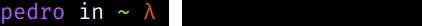

  <!-- <li> 🌱 At moment i am learning Python! </li> -->
<h2>   Hello, how are you?👋🤙 </h2>

    

  My name is Pedro Luiz Gonçalves, I am 28 years old, and I currently reside in Maceió, Alagoas. 
  From a young age, I have been deeply passionate about technology, a passion that has grown with me over the years.
  
  I currently work as a Software Developer at Techands, specializing in backend development with Node.js and Nest.js, and frontend development with React.js.
  
  I hold a degree in Mechatronics Engineering and a postgraduate degree in Software Engineering. More than just a profession, software development is something that truly fascinates me. I am passionate about continuous learning.
  At moment Working on Techands company!
  

  <ul>
    <li>Bachelor in mechatronics enginnering at <a href="https://www.unit.br" target="_blank" rel="noopener noreferrer">UNIT</a> (2015 - 2020) 🎓 🤖 👨‍🔧</li>
    <li>Exchange in mechatronics enginnering at <a href="https://www.uevora.pt" target="_blank" rel="noopener noreferrer">Évora University</a> (2017-2018) 🎓 ✈️ 🇵🇹</li>
<!--     <li>Bachelor in Computer Science in <a href="https://estacio.br" target="_blank" rel="noopener noreferrer">UNESA</a> (2023 - 2027) 🎓 💻 👨‍🔬 </li> -->
    <li>Postgraduate in Software Enginnering at <a href="https://faculdademetropolitana.edu.br/" target="_blank" rel="noopener noreferrer">FAMEESP</a> (2023 - 2024) 🎓 💻 👨‍💻</li> 
  </ul>
  

  In my personal life, I'm passionate about programming and the maker culture, often engaging in personal projects such as 3D printing. 
  
  I also have a keen interest in physical fitness, with a focus on CrossFit and weightlifting, even though I'll humbly admit I'm not a pro in these areas.
  
  My diverse range of interests extends to reading; I enjoy literature from Dostoevsky to Patrick Rothfuss. 
  
  Additionally, I have a deep love for music, encompassing various genres, including bands like Alice in Chains, Pantera, Municipal Waste, and many more.
  

  <h2>Stacks & Tools</h2>
<!--   

    
  
 -->
  

    
    
    
    
    
  

  

  
  <a href="https://github.com/pllsg96">
  
  

  <h3> Social media and contact </h3>
  
  
  
   

